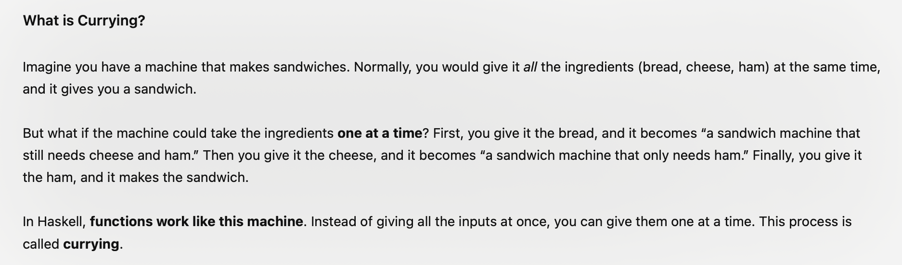

# Haskell

## What is Haskell?
- A **purely functional programming language** (NOT IMPERATIVE e.g. C, C++, Python, Java, etc)
- Note that as haskell is a **pure** functional language, this means functions have 0 side effects (no modifying variables, changing state or performing I/O operations)
- Note that Haskell is **lazy** - it employs lazy evaluation (unlike strict evaluation in Java, Python)
	- easier to work with infinite data structures (e.g. infinite length lists)
	- 
  
## What is functional programming?
- A programming paradigm (a way of writing programs) in the form of mathematical functions (thinking like a mathematician)
- You focus on **what** you want to happen, not how you want that thing to happen step by step (as you did in C, Python)
- Fun for those who like math!
- Example of Functional programming languages: Haskell, OCaml, Scala (not the nightclub)
- https://www.youtube.com/watch?v=LnX3B9oaKzw (computerphile video on Functional Programming / Haskell)
  
## Learning functional from imperative programming
- change your mindset! (its hard at first but once it clicks it gets really fun :D)!
- instead of thinking "how" to achieve this, think about **WHAT** the result should be, by describing the result in the form of transformations or mappings of data
- in imperative programming, you describe the step by step on how to achieve something, that is not the case in functional programming.
---
# Haskell Fundamentals

### Haskell functions
- Creating your own functions is easy
```
double :: Int -> Int
double x = x + x

doubleTwo x y = double x + double y

quad x = double (double x)
```

- Doing comparisons with `if then else`
```
sign x = if x > 0 then 1 
	 else if x == 0 then 0
	 else -1
```

With **pattern matching**
- Pattern matching consists of specifying patterns to which some data should conform and then checking to see if it does and deconstructing the data according to those patterns.
```
sign x | x > 0     = 1
       | x == 0    = 0
       | otherwise = -1
```

### Lists
- They are **homogeneous** data structures, meaning they need to be in same type
- To define a list in Haskell (GHCi), use the keyword `let`

```
let x = [1,2,3,4,5]
```

**Getting list elements**
```
ghci> "Hello" !! 0
'H'
```

**Comparing lists**
In haskell, you can compare lists if the items can be compared (e.g. letters, integers, etc.) where items are compared in lexicographical order (e.g. dictionary) order with <. <=, >, >=
```haskell
ghci> [5,3,7] > [4,2,5]
True
ghci> [1,2,3] <= [2,3,4]
True
ghci> [2,3,4,5,6] > [5,2,3,4,5]
False
```

**List Concatenation**
- `x : []` adds `x` to an empty list
- Concatenation is the basis of iterating over lists in Haskell with recursion
```haskell
ghci> 2 : []
[2]

ghci> 3 : (2 : (1 : []))
[3,2,1]

ghci> 
```

**List Comprehension**
Similar to set comprehension (set-builder notation)
```haskell
ghci> [x | x <- [1..10], even x]
[2,4,6,8,10]

ghci> [x*3 | x <- [1..5]]
[3,6,9,12,15]

ghci> [(x,y) | x <- [1,2], y <-[2,3]]
[(1,2),(1,3),(2,2),(2,3)]
```

**Ranges**
If you want a list from 1 to 100, you do not need to use list comprehension or type from 1 to 100 all the way, you can just do
`[1..100]`

examples:
```haskell
ghci> ['a'..'z']
'abcdefghijklmnopqrstuvwxyz'

ghci> ['H'..'M']
'HIJKLM'

ghci> [2,4..20]
[2,4,6,8,10,12,14,16,18,20]

ghci> [100,99..95]
[100,99,98,97,96,95]

ghci> [0.1,0.3..0.9]
[0.1,0.3,0.5,0.7,0.89999999999...]
```


**What happened to loops?**
- Functional programming use **recursion** instead of `for` or `while` loops.
- To access each element in the list from start to end, you can use recursion or **higher-order functions** (will come to that later)


### Haskell Types

#### Types
**Basic Types**
- **Int**: Represents fixed-precision integers.
- **Integer**: Represents arbitrary-precision integers.
- **Float**: Represents single-precision floating-point numbers.
- **Double**: Represents double-precision floating-point numbers.
- **Char**: Represents a single character.
- **Bool**: Represents boolean values (True or False).
- **String**: Represents a sequence of characters (essentially a list of Char).

**Compound Types**
- **Tuples**: Groups multiple values into a single value (e.g., (Int, String)).
- **Lists**: Represents a sequence of elements of the same type (e.g., [Int]).

**Custom Types**

You can define your own types using data:
```
data Shape = Circle Float | Rectangle Float Float
```
--
#### Typeclasses
- A **typeclass** defines a set of functions or methods that a type must implement to be considered an instance of that typeclass.
- Allow you to define generic interfaces that provide a common feature set over a wide variety of types

Examples:
- Eq (Equality, provides equality operators)
```
class Eq a where
    (==) :: a -> a -> Bool
    (/=) :: a -> a -> Bool
```

If a type implements Eq, then you can test the type's values for equality

- Ord (Ordered, provides comparsion operators e.g. `<, <=, >, >=`)
- Num (Numeric, provides basic arithmetic e.g. `+, -, *, /`)
- Read (Readable)
- Show (Showable)

**Types vs Typeclasses**
- **Types**: Define what data is (e.g., Int, String, custom types).
- **Typeclasses**: Define what operations are possible on a type (e.g., equality for Eq, ordering for Ord).


#### Generic Types
- Haskell types that are defined in a way that can work with multiple or any other types
- Represented with **type variables**, which are placeholders for any type. Type variables are usually written as lowercase letters (e.g., a, b, t).

---
### Higher Order Functions
Haskell functions can take in functions as parameters and return functions as return values. A function which can do that is called a **higher-order function**

**What is currying?** (everyone asks that)
- Currying is a technique in functional programming where a function that takes multiple arguments is transformed into a sequence of functions, each taking single arguments.
- All functions in Haskell are curried by default, so all Haskell functions take 1 argument and return another function

ChatGPT definition:


Example:
```
add :: Int -> Int -> Int
add x y = x + y
```

is equivalent to
```
add :: Int -> (Int -> Int)
add x = \y -> x + y
```

**Examples of higher-order functions:**
- map
- filter
- foldr/foldl/foldr1/foldr1

**Map**
```
map :: (a -> b) -> [a] -> [b]
map f [] = []
map f (x:xs) = f x : map f xs
```

`map` takes a function `(a -> b)` and returns another function that takes a list `[a]` and produces a list `[b]`.


**Filter**
```
filter :: (a -> Bool) -> [a] -> [a]
filter f [] = []
filter f (x:xs) | f x = x : filter f xs
		| otherwise = filter f xs
```

**The folding functions**
- foldr (fold right)
- foldl (fold left)
- foldr1 (fold right, where rightmost value is used as accumulator)
- foldl1 (fold left, where leftmost value is used as accumulator)

---
### Further Resources
- https://learnyouahaskell.github.io/
  - i used that book to create this markdown notes
- https://www.youtube.com/watch?v=02_H3LjqMr8
  - 1 hour tutorial to haskell
- 